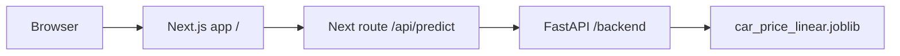

# Car Price Prediction

Next.js + FastAPI car price prediction app. The browser uses the Next.js UI and `/api/predict`; the Next route validates payloads with zod and proxies to the FastAPI model backend.

## Architecture



## Local Development

Install frontend dependencies:

```bash
pnpm install
```

Train the model and start FastAPI:

```bash
cd model
uv sync --group dev
uv run python train_model.py
uv run --group dev uvicorn app:app --reload --host 127.0.0.1 --port 8000
```

Start Next.js in another terminal:

```bash
pnpm dev
```

Open `http://127.0.0.1:3000`.

## Production Build

```bash
pnpm lint
pnpm build
```

FastAPI smoke test:

```bash
cd model
uv run python -c "from fastapi.testclient import TestClient; from app import app; c=TestClient(app); print(c.get('/health').json()); print(c.post('/predict', json={'Engine_size':3,'Horsepower':250,'Wheelbase':105,'Width':70,'Length':180,'Curb_weight':3.5,'Fuel_capacity':18,'Fuel_efficiency':22}).json())"
```

## Vercel Deployment

This repo is configured for Vercel Services in `vercel.json`:

- `web`: Next.js at `/`
- `backend`: FastAPI at `/backend`

Run locally through Vercel routing:

```bash
vercel dev -L
```

Deploy:

```bash
vercel deploy
vercel deploy --prod
```

See `docs/DEPLOYMENT.md` for full setup, health checks, and bundle notes.
